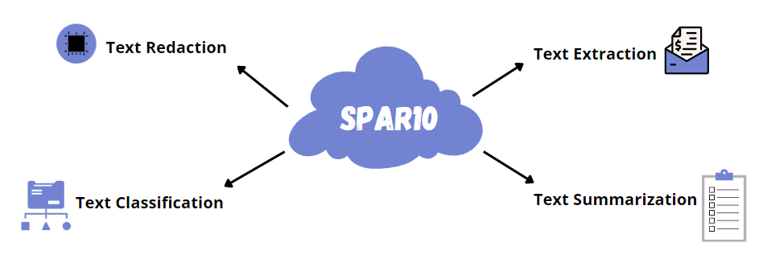

    
# SPAR10: AI Enabled Text Processing Framework

    
## Frameworks and language used

    
## Libraries used

## Database

    
## Editors and workspace

    
## Front end tech stack

   
# Introduction

Large volumes and a variety of data are generated by today's businesses in the form of e-documents, scanned images, emails, text messages and responses, user reviews, and so on. All of this is going to grow tremendously when they go digital. Almost 80\% of the data created is semi-structured or unstructured, and the wide variety of document kinds and formats makes automation and analysis difficult. For enterprises to analyze and derive insights from thousands of documents, it would require huge manual effort and would be time-consuming.

**SPAR10** is an intelligent AI-driven product which helps businesses automate the process of capturing and analyzing structured and unstructured text data through AI/ML. It is developed as a web application, using a variety of Linguistic and Machine Learning models along with Natural Language Processing to solve problems associated with text data. It applies different algorithms for each business problem.  
    

    
# Technical Manual
    

## Tech stack used: 
<ul>
    <li><strong>Programming Languages:</strong> Python, JavaScript</li>
    <li><strong>Libraries:</strong> Numpy, Pandas, OpenCV, PIL, Tensorflow, Tabula, Camelot, Nltk, Scikit-Learn, Seaborn, Matplotlib, Pickle, Keras, h5py</li>
    <li><strong>Front End Tools:</strong> HTML5, CSS, JQuery, Bootstrap</li>
    <li><strong>Back End Tools:</strong> Flask</li>
    <li><strong>Database:</strong> MySQL,SQLAlchemy</li>
    <li><strong>Editors/IDE:</strong> VScode, Jupyter Notebook, Git bash, Google Colab</li>
</ul>

## Software required: 
<ul>
    <li> Web browser: To use the application.</li>
    <li> Install Python 3.9.7 from https://www.python.org/downloads/ </li>
    <li> Install all the dependencies using the requirements.txt file using the following command:
        
    pip install -r requirements.txt
        
</ul>
    
## Setting up the database: 
https://www.sqlite.org/2021/sqlite-dll-win64-x64-3370000.zip download this and extract it to anaconda3/dlls

## Running the application:
Execute the following command on Command Prompt:

        python main.py

    
### Developed with :hearts: by <a href="https://github.com/Purviharniya">Purvi Harniya</a>, <a href="https://github.com/riya-joshi-401">Riya Joshi</a>, <a href="https://github.com/akhil-here">Akhil Namboodiri</a> and <a href="https://github.com/Sagar-Kamat">Sagar Kamat</a>
    

